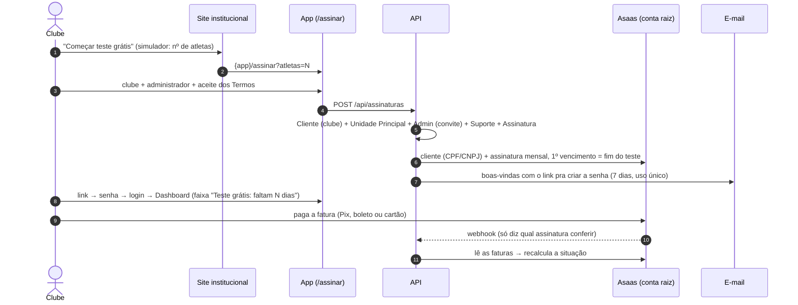

# Assinatura pelo site

> Status: **fase 1 implementada** (2026-10-09). Testada com um Asaas falso (testes HTTP) e no navegador sem gateway; **falta validar no
> sandbox do Asaas** com uma chave de verdade (criar a assinatura, pagar a fatura, ver o clube virar "Ativa").

O clube assina sozinho pelo site, recebe um e-mail, cria a senha e entra como **Admin** — sem ninguém da equipe do produto no meio.
Clientes criados à mão (antes do site, ou escola infantil) **não têm assinatura** e nada disso os afeta.

## Decisões (2026-10-08/09)

| Tema | Decisão |
|---|---|
| Teste grátis | **7 dias, configurável** (`Assinatura:DiasTeste`; **0 = sem teste**, paga antes de entrar). Sem cartão no cadastro. |
| Preço | **R$ 99 fixo + R$ 3 por atleta** (`Assinatura:PrecoFixo`/`PrecoPorAtleta`; o site tem os mesmos em `site/precos.js`). |
| 1ª fatura | Pelos atletas **informados no cadastro**. (Recalcular pelos atletas ativos é da fase 2.) |
| Formas de pagamento | **Pix, cartão e boleto** — o clube escolhe na página de pagamento do Asaas (`billingType: UNDEFINED`); nunca recebemos dado de cartão. |
| Atraso | Suspende **7 dias depois do vencimento, configurável** (`Assinatura:DiasToleranciaAtraso`). |
| Teste nunca pago | Apagar os dados **30 dias depois da suspensão** (`Assinatura:DiasRetencaoAposSuspensao`) — **ainda não aplicado** (fase 3). |
| Mesmo CPF/CNPJ | Permitido (um dono pode ter duas escolas). Sem aviso: diria a um anônimo quem já é cliente. |
| Segmento | Sempre **Clube**. |

## Fluxo

**Sem teste (`DiasTeste = 0`)**: o cadastro cria tudo igual, mas a assinatura nasce `AguardandoPagamento` (1ª fatura vence hoje), a tela
mostra **"Pagar agora"** e o e-mail de boas-vindas **só sai quando o pagamento é confirmado**. (O desenho inicial previa uma tabela de
"pedido" fora do isolamento por cliente; criar o cliente já no cadastro deixou um caminho só pros dois modos.)

## Peças

- **Entidade** `Assinatura` (uma por cliente, isolada por `ClienteId` como as demais; migration `AddAssinaturas`, só tabela nova):
  situação, teste até, 1º vencimento, valor, atletas informados, dados de cobrança (CPF/CNPJ, cidade, celular, e-mail), ids no Asaas +
  ambiente, link da fatura em aberto, quando o convite saiu, datas (criada, suspensa, cancelada) e a **prova do aceite dos Termos**
  (versão `AssinaturaService.VersaoTermosUso`, data, IP, navegador).
- **`SituacaoAssinatura`** (inteiro, **não reordenar**): `AguardandoPagamento`, `EmTeste`, `Ativa`, `EmAtraso`, `Suspensa`, `Cancelada`.
  Regra pura em `SituacaoAssinaturaCalculo` (`Escola.Infrastructure/Assinaturas/`, com testes): fatura vencida há mais que a tolerância →
  `Suspensa`; vencida dentro da tolerância → `EmAtraso` (ou `AguardandoPagamento` se nunca pagou e não teve teste); nada vencido e
  nada pago → `EmTeste`/`AguardandoPagamento`; senão `Ativa`. Sem faturas conhecidas usa o 1º vencimento (o teste acaba mesmo sem
  gateway). **Bloqueiam**: `AguardandoPagamento`, `Suspensa`, `Cancelada`.
- **`AssinaturaService`** (`Escola.Api/Servicos/`): `CadastrarAsync` (cliente novo = escopo novo com `ClienteAtual.Definir`), 
  `AtualizarAsync(clienteId)` (abre a assinatura no Asaas se faltou, lê as faturas, recalcula, audita a mudança como "Sistema", manda o
  convite se o acesso acabou de ser liberado). **Gateway configurado e fora do ar = não mexe na situação** (não suspende quem pagou por
  falha nossa).
- **`AssinaturasWorker`**: recalcula todas as assinaturas a cada `Assinatura:IntervaloAtualizacaoMinutos` (60) — é o que faz o teste
  acabar e a suspensão acontecer. Desligado no ambiente `Testing`.
- **Endpoints** (`AssinaturasController`): `GET /api/assinaturas/plano` e `POST /api/assinaturas` (**anônimos**; cadastro com freio de
  5 por IP a cada 15 min), `POST /api/assinaturas/asaas/webhook` (anônimo, cabeçalho `asaas-access-token` = `Assinatura:WebhookToken`; o
  corpo só diz qual assinatura conferir), `GET /api/assinaturas/minha` e `POST …/minha/atualizar` (**Admin ou Suporte**; 404 pra cliente
  sem assinatura).
- **Bloqueio**: na `Autenticacao.ConferirAsync` (a cada requisição) e no login. Assinatura bloqueada → a equipe é recusada (401, não
  entra); o **Admin entra**, mas um middleware responde **402** a tudo fora de `/api/assinaturas`, `/api/auth` e `GET
  /api/configuracao/escola`. O Suporte não é afetado. `Cliente.Ativo` continua sendo o interruptor manual do Suporte.
- **Frontend**: `/assinar` (pública, 2 etapas + "confira seu e-mail" ou "Pagar agora"; link no login: "Comece seu teste grátis"),
  **Configurações → Assinatura** (`/configuracoes/assinatura`, Admin/Suporte: situação, "Pagar agora", "Já paguei — conferir agora",
  plano, faturas), **faixa no topo** pro Admin (`app-aviso-assinatura`: dias de teste, atraso, suspenso), e o Admin bloqueado é levado
  pra tela da assinatura pelos guards e pelo interceptor (402).
- **Site institucional**: botões "Começar teste grátis" apontam pro `/assinar` do app (`URL_APP` em `site/precos.js`), com o número de
  atletas do simulador. O `site/assinar.html` (protótipo) foi removido.

## Fases

| Fase | Entrega |
|---|---|
| **1 — MVP** ✅ | Tudo acima. |
| **2 — Ciclo** | Recalcular o valor todo mês pelos atletas **ativos** (atualizar a assinatura no Asaas antes da fatura), cancelar pela tela, trocar forma de pagamento, e-mail antes do fim do teste e do vencimento, e o Suporte vendo a assinatura na Plataforma. |
| **3 — Crescimento** | Limpeza dos testes nunca pagos (30 dias após suspender), cupons, NFS-e pelo Asaas, painel do Suporte com todos os clientes. |

## Pendências antes de produção

1. **SMTP** — sem ele o e-mail de boas-vindas não chega.
2. **Termos de Uso e Política de Privacidade** — o cadastro grava o aceite da versão `2026-10-rascunho`, mas os textos ainda não existem.
   Publicou → trocar `AssinaturaService.VersaoTermosUso` e pôr os links na tela `/assinar` e no site.
3. **Validar no sandbox do Asaas** e cadastrar o webhook da conta raiz no painel (ver `docs/DEPLOY.md`).
4. `URL_APP` em `site/precos.js` com o domínio de produção.
