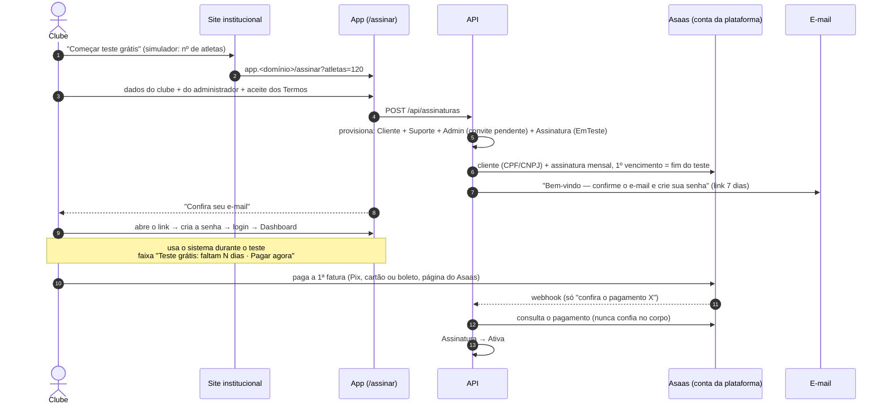

# Assinatura pelo site — desenho do fluxo

> Status: **proposta** (2026-10-08). Nada implementado ainda.

Objetivo: o clube assina sozinho pelo site, recebe um e-mail, cria a senha e entra como **Admin** — sem ninguém da equipe do
produto no meio ("o sistema se vende sozinho"). Hoje cliente novo é manual (`INSERT` em `Clientes` + reiniciar a API + Suporte
convida o Admin, ver `docs/DEPLOY.md`).

## Decisões tomadas (2026-10-08)

| Tema | Decisão |
|---|---|
| Teste grátis | **Sim, 7 dias, configurável** (`Assinatura:DiasTeste`; **0 = sem teste**, paga antes de entrar). Sem pedir cartão no cadastro. |
| 1ª fatura | **Fixo + R$ 3 × atletas informados no cadastro**. Da 2ª em diante, pelos atletas **ativos** no sistema. |
| Formas de pagamento | **Pix, cartão de crédito e boleto** — o clube escolhe na página de pagamento do Asaas. |
| Mesmo CPF/CNPJ | **Permitido** (um dono pode ter duas escolas). Só avisa que já existe assinatura com esse documento. |
| Segmento do cliente novo | **Clube** (o site fala com escolas de futebol). Escola infantil continua manual. |

## Visão geral (com teste grátis)

**Com `DiasTeste = 0`** a ordem inverte: o cadastro só cria um **pedido**, a 1ª fatura vence hoje, a tela mostra o link de
pagamento e o provisionamento (passos 4–6 acima) acontece **quando o pagamento confirma**. O mesmo serviço de provisionamento
atende os dois casos — muda só o gatilho.

## Peças

### 1. Onde fica o formulário: no app, não no site estático

O site (`site/`) continua estático e só **leva** pra `app.<domínio>/assinar?atletas=N`. O formulário é uma rota pública do
Angular (`/assinar`, sem guard, como `/entrar` e `/esqueci-senha`):

- mesma origem da API → **sem CORS** pra abrir endpoint anônimo;
- reaproveita o que já existe e segue as regras do projeto (toasts, `*` obrigatório, nada de widget nativo com texto, CPF/CNPJ
  com dígito verificador como na Matrícula);
- a tela de espera do modo sem teste precisa consultar a API.

O `site/assinar.html` vira referência visual; o botão do site passa a dizer **"Começar teste grátis"** quando houver teste.

### 2. Entidades

**`Assinatura`** (por cliente, isolada por `ClienteId` como as demais): `Situacao`, `TesteAte?`, `ValorMensal`,
`AtletasInformados`, `IdClienteAsaas`, `IdAssinaturaAsaas`, `ProximoVencimento`, `CriadaEm`, `CanceladaEm?`, e a **prova do
aceite dos Termos** (versão, texto exato, data, IP, navegador — mesmo padrão do `TermoAceite` da matrícula). Uma por cliente
(índice único).

`SituacaoAssinatura` (**não reordenar**, gravado como inteiro): `EmTeste`, `Ativa`, `EmAtraso`, `Suspensa`, `Cancelada`.
Sempre derivada de eventos do Asaas + datas — nunca editada à mão (o Suporte continua com `Cliente.Ativo` como interruptor manual).

**`PedidoAssinatura`** — só no modo **sem teste**: guarda o cadastro até o pagamento confirmar. É **entidade de plataforma, sem
`ClienteId`** (o cliente ainda não existe). Hoje `EscolaDbContext.AplicarIsolamentoPorCliente` põe `ClienteId` em **toda**
entidade menos `Cliente`: vai precisar de uma exceção explícita e pequena (interface marcadora `IEntidadePlataforma` ou lista
fixa ao lado de `Cliente`). Só os endpoints de assinatura e o webhook tocam nela. Expira em 48 h sem pagamento.

### 3. Provisionamento (`ProvisionadorCliente`, idempotente)

1. Cria `Cliente` (`Nome` do clube, `Segmento = Clube`, `Ativo = true`).
2. **Em um escopo novo com `ClienteAtual.Definir(novoId)`** (regra do login único: outro cliente = outro escopo):
   - roda o `SuporteProvisionador` pra esse cliente (hoje ele só roda na subida da API — precisa virar chamável);
   - cria a configuração padrão (fuso de Brasília, cor da marca) e avaliar já criar a "Unidade Principal";
   - cria o `Usuario` Admin com `SenhaHasher.ConvitePendente` (mesmo esquema do convite pela Plataforma);
   - cria a `Assinatura`;
   - auditoria `Cliente criado pela assinatura do site`, assinada como "Sistema".
3. No Asaas (conta **raiz** — a mesma `Asaas:ApiKey` que abre as subcontas, agora cobrando **para a plataforma**):
   `POST /customers` com o CPF/CNPJ e `POST /subscriptions` mensal com `billingType: UNDEFINED` (o clube escolhe Pix, cartão ou
   boleto na página do Asaas), `nextDueDate` = fim do teste (ou hoje), `externalReference` = id da assinatura. **Nunca
   recebemos dado de cartão** no nosso formulário.
   Falha no Asaas **não desfaz o cliente**: a assinatura fica sem ids e uma tarefa de fundo tenta de novo (o clube já pode usar o teste).
4. Envia o e-mail por `ILinkSenhaService` com um **tipo novo** `TipoLinkSenha.BoasVindasAssinatura` (mesmo link de convite de 7
   dias e uso único; texto de boas-vindas, dias de teste e valor do plano).

Rodar duas vezes não duplica nada (no modo sem teste, webhook e conciliação podem chegar juntos): o pedido guarda o `ClienteId`
gerado e é conferido antes.

### 4. Do e-mail ao login

O link cai no `redefinir-senha?token=…&convite=1` que já existe; ao salvar a senha a tela leva pro `/entrar` — o fluxo pedido. O
guard da rota `''` manda o Admin de clube pro **Dashboard**. Melhoria futura: "primeiros passos" no Dashboard vazio (1ª
categoria, atletas, Pix).

### 5. Teste, pagamento e suspensão

- **Durante o teste**: faixa no topo do app pro Admin — "Teste grátis: faltam N dias · **Pagar agora**" (abre a fatura do Asaas,
  `invoiceUrl`). Pagar antes do fim já vira `Ativa`, e o teste continua até a data (o 1º vencimento é no fim do teste).
- **Confirmação do pagamento**: webhook novo `POST /api/assinaturas/asaas/webhook` (anônimo, cabeçalho `asaas-access-token`
  comparado em tempo fixo, separado do webhook das subcontas). O corpo **só diz qual pagamento conferir** — a API consulta no
  Asaas antes. Responde 200 até pra pagamento desconhecido. Mais uma **conciliação periódica** das assinaturas `EmTeste`/
  `EmAtraso` (funciona sem endereço público, como o `ConciliacaoPixWorker`). Eventos: `PAYMENT_RECEIVED`/`CONFIRMED` → `Ativa`;
  `PAYMENT_OVERDUE` → `EmAtraso`; `PAYMENT_REFUNDED`/`SUBSCRIPTION_DELETED` → tratar.
- **Fim do teste sem pagamento / fatura em atraso**: tolerância de **N dias** (`Assinatura:DiasToleranciaAtraso`) com a faixa em
  vermelho; depois → `Suspensa`.
- **Suspensa ≠ cliente desativado.** Hoje cliente com `Ativo = false` não deixa ninguém entrar — mas um clube suspenso por
  falta de pagamento **precisa conseguir pagar**. Então: na assinatura suspensa a equipe não entra, o **Admin entra só na tela
  Assinatura** (faturas + "Pagar agora"), e os demais endpoints devolvem 402/403 pra ele. Pagou → `Ativa` → tudo volta.
  `Cliente.Ativo` segue sendo o interruptor manual do Suporte (bloqueia tudo, inclusive o Admin).
- **Teste que nunca foi confirmado**: cliente cujo Admin não criou a senha até o fim do teste é suspenso igual; avaliar apagar
  depois de X dias (são dados de um clube que nunca usou — ver LGPD).

### 6. Tela "Assinatura" (Admin)

Em **Configurações → Assinatura** (só Admin; o Suporte vê pela Plataforma): situação, plano e valor, dias de teste restantes,
faturas (do Asaas) com link de pagamento, e cancelar. Na fase 1 basta situação + "Pagar agora" + faturas.

### 7. Segurança e abuso (endpoint anônimo que cria cliente)

- Com teste grátis, **cada cadastro cria um cliente de verdade** — então: freio por IP (ex.: 5/hora, mesmo esquema do
  `LimitadorTentativasLogin`), e captcha se aparecer abuso.
- CPF/CNPJ com dígito verificador; e-mail validado. Ninguém entra sem confirmar o e-mail (a conta nasce com convite pendente).
- E-mail que já tem conta em outra escola é permitido (o login único pede a escolha).
- Nenhum segredo na URL; a página de pagamento é o link que o Asaas devolve.
- Testes: os endpoints anônimos entram no `MapaDePermissoes`; teste HTTP com Asaas falso (como `PagamentoAsaasHttpTests`)
  cobrindo cadastro → convite → senha → login, pagamento → `Ativa`, atraso → `Suspensa` (Admin só na tela Assinatura), e o modo
  `DiasTeste = 0`.

## Fases

| Fase | Entrega |
|---|---|
| **1 — MVP** | `/assinar`, provisionamento, assinatura no Asaas, e-mail de boas-vindas, teste de N dias com faixa "Pagar agora", webhook + conciliação, suspensão (Admin só na tela Assinatura), tela Assinatura básica, modo sem teste. |
| **2 — Ciclo** | Recalcular o valor todo mês pelos atletas **ativos** (atualizar a assinatura no Asaas antes de gerar a fatura), cancelar pela tela, trocar forma de pagamento, aviso por e-mail antes do fim do teste e do vencimento. |
| **3 — Crescimento** | Cupons, NFS-e automática pelo Asaas, painel do Suporte com todos os clientes e assinaturas, limpeza de testes abandonados. |

## Configuração nova

| Chave | Padrão | Uso |
|---|---|---|
| `Assinatura:DiasTeste` | 7 | Dias de teste grátis. 0 = paga antes de entrar. |
| `Assinatura:PrecoFixo` / `Assinatura:PrecoPorAtleta` | a definir / 3 | Tabela de preços (o site tem a mesma em `site/precos.js` — manter iguais). |
| `Assinatura:DiasToleranciaAtraso` | a definir | Dias depois do vencimento até suspender. |
| `Assinatura:WebhookToken` | — | Token do webhook da assinatura (diferente do das subcontas). |

Por config do deploy, como o resto; uma tela de plataforma pra mudar sem reiniciar fica pra fase 3.

## Pré-requisitos de ambiente

- **SMTP configurado** — sem ele o e-mail de boas-vindas não chega e o fluxo trava (hoje não há SMTP).
- `App:UrlBase` (já existe) e `Asaas:ApiKey` da conta raiz **de produção**.
- Termos de Uso e Política de Privacidade publicados (o aceite grava a versão).

## Ainda em aberto

1. **Valor do preço fixo** (o site usa R$ 149 provisório).
2. **Tolerância de atraso** antes de suspender (sugestão: 7 dias depois do vencimento).
3. Na 1ª fatura **com teste**, usar os atletas **informados** (decidido) — ou, já que no fim do teste o clube tem atletas reais
   cadastrados, o maior entre informados e ativos?
4. Quanto tempo guardar um clube de teste que nunca pagou antes de apagar.
